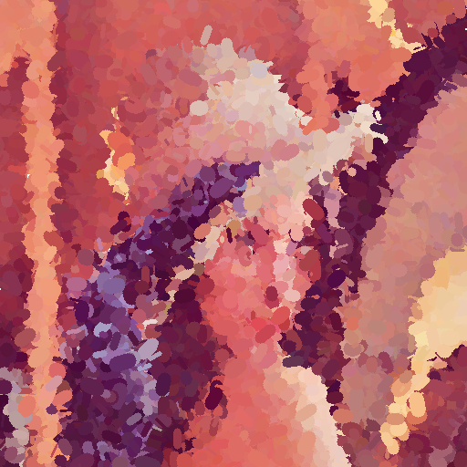
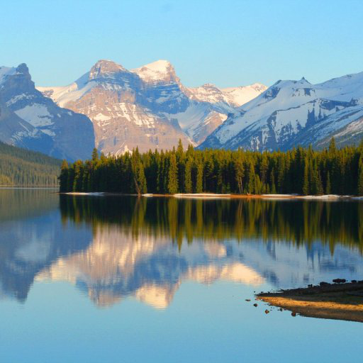
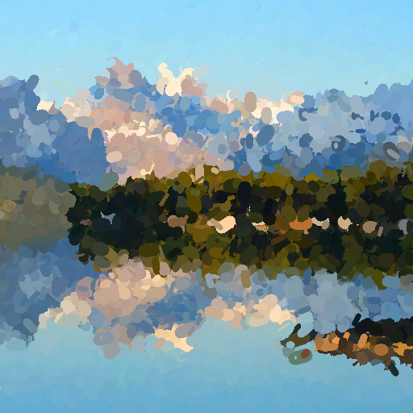

# Application of Genetic Algorithms to Generating Paintings

## Algorithm

This implementation is based on a paper of A. Nasen and M.C. Lewis (2018). _Applying Genetic Algorithms to Generating Paintings_. Accessed at [link](https://csce.ucmss.com/cr/books/2018/LFS/CSREA2018/IPC3627.pdf).
However, modifications were done to the original approach due to the fact that some operations like crossover and mutation were explained only generally and no input parameters were provided. That is why I applied my own ideas of how to construct those operations, changed some parts and used additional techniques like the ageing algorithm.

The structure of the program, from a high level, is as follows:
1. The generator function generates n initial random paintings
2. The selector function selects n/3 paintings with the highest score.
3. The crossover function pairs selected paintings by two and combines strokes from each pair and generate new paintings. Those paintings are added to the population.
4. The selector function selects a specified number of paintings and with a specified probability mutates randomly chosen parameter of strokes.
5. The ageing algorithm increases ages and remove paintings older than specified age. This technique helps increasing variation of paintings in the population.
6. The selector function selects top n paintings for the population for the next epoch.
7. The algorithm starts a new epoch from the step 2.

The fitness function is taken from the original paper and is just the maximal possible score minus a mean absolute difference between images.

## Program Usage

### Prerequisites
You may install all the required libraries with pip:
```
pip install -r requirements.txt
```

### Run the generation process
You mat run the algorithm using the following command providing paths of input and output images:
```
python app.py --input <input image path> --output <output image path>
```

For more information about arguments to pass. Refer to the `help` message:
```
usage: app.py [-h] [--input INPUT] [--output OUTPUT] [--epochs EPOCHS]
              [--population-size POPULATION_SIZE] [--n-mutations N_MUTATIONS]
              [--stroke-mut-ratio STROKE_MUT_RATIO]
              [--logging_every LOGGING_EVERY] [--n-strokes N_STROKES]
              [--max-age MAX_AGE] [--color-max-step COLOR_MAX_STEP]
              [--length-max-step LENGTH_MAX_STEP] [--length-min LENGTH_MIN]
              [--length-max LENGTH_MAX] [--width-max-step WIDTH_MAX_STEP]
              [--width-min WIDTH_MIN] [--width-max WIDTH_MAX]
              [--position-max-step POSITION_MAX_STEP]
              [--degrees-max-step DEGREES_MAX_STEP] [--seed SEED]

optional arguments:
  -h, --help            show this help message and exit
  --input INPUT, -i INPUT
                        Path to input image file,
  --output OUTPUT, -o OUTPUT
                        Path for the output file.
  --epochs EPOCHS, -e EPOCHS
                        Number of evolution epochs.
  --population-size POPULATION_SIZE, -p POPULATION_SIZE
                        Population size.
  --n-mutations N_MUTATIONS, -m N_MUTATIONS
                        Number of paintings to mutate every epoch.
  --stroke-mut-ratio STROKE_MUT_RATIO
                        Mutation ratio for strokes.
  --logging_every LOGGING_EVERY, -l LOGGING_EVERY
                        Number of epochs to pass for printing a log. If it is
                        -1, do not print logs.
  --n-strokes N_STROKES, -s N_STROKES
                        Number of strokes on a painting.
  --max-age MAX_AGE     Max age for staying in population.
  --color-max-step COLOR_MAX_STEP
                        Maximal step size to mutate each color element of a
                        stroke.
  --length-max-step LENGTH_MAX_STEP
                        The maximal step size to mutate a stroke length.
  --length-min LENGTH_MIN
                        The minimal length allowed.
  --length-max LENGTH_MAX
                        The maximal length allowed.
  --width-max-step WIDTH_MAX_STEP
                        The maximal step size to mutate a stroke width.
  --width-min WIDTH_MIN
                        The minimal width allowed.
  --width-max WIDTH_MAX
                        The maximal width allowed.
  --position-max-step POSITION_MAX_STEP
                        The maximal step size to mutate position coordinates
                        of a stroke.
  --degrees-max-step DEGREES_MAX_STEP
                        The maximal step size to mutate orientation degrees of
                        a stroke.
  --seed SEED           Seed for random.

```

## Examples

| Original Image | Generated Image (v1.2.3)* |
| :------------- | :----------: |
|  |  |
|  |  |


*Using the default parameters of version 1.2.3: epochs=25, population-size=50, n-mutations=25, stroke-mut-ratio=0.2, n-strokes=20000 and etc.